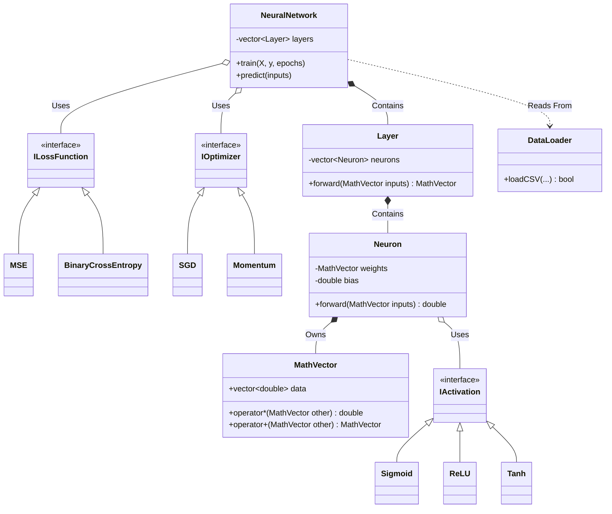

# MiniANN: Object-Oriented Artificial Neural Network in C++

## 1. Project Overview and Architectural Design
MiniANN is a custom, from-scratch artificial neural network library built entirely in C++ without external machine learning dependencies. The architecture is strictly object-oriented, leveraging advanced C++ principles such as polymorphism, encapsulation, and operator overloading to create a highly modular and extensible framework. 

The core design philosophy separates the mathematical blueprints (Interfaces) from the physical network topology (Neurons and Layers), while a central engine (NeuralNetwork) orchestrates memory management, forward propagation, and backpropagation via the chain rule of calculus.

#### Project Architecture


## 2. Directory Structure
The project adheres to professional C++ repository standards, enforcing a strict separation between headers, source logic, raw data, and compiled binaries.

* **`include/` (Blueprints):** Contains all `.hpp` header files defining class structures, interfaces, and inline mathematical templates.
* **`src/` (Implementation):** Contains all `.cpp` files containing the heavy algorithmic logic and execution entry points.
* **`data/` (Data Pipeline):** Isolates raw datasets (`data.csv`) and saved model state files (`trained_classification_model.csv`).
* **`bin/` (Executables):** The dedicated output directory for all compiled `.exe` files, keeping the root workspace clean.

## 3. Core Components and File Architecture

### 3.1 The Math Engine (`MathVector.hpp`)
Serves as the foundational linear algebra engine for the network. It wraps standard C++ `vector<double>` arrays into a custom `struct` with overloaded mathematical operators (`*`, `+`, `-`). This allows the network to compute dot products ($w \cdot x$) and scale gradients natively without writing explicit loops in the core forward/backward passes.

### 3.2 Polymorphic Interfaces (`activations.hpp / lossfunction.hpp / optimizer.hpp`)
Defines the strict contracts (Abstract Base Classes) for interchangeable network components using pure virtual functions (`= 0`).
* **`IActivation`:** Defines `activate()` and `derivative()`. Implemented by `Sigmoid`, `ReLU`, and `Tanh`.
* **`ILossFunction`:** Defines `calculate()` and `derivative()`. Implemented by `MSE` (Mean Squared Error) and `BinaryCrossEntropy` (optimized for binary classification targets).
* **`IOptimizer`:** Defines `calculateUpdate()` overloaded for both array weights and scalar biases. Implemented by standard `SGD` and `Momentum` (which tracks an exponentially weighted moving average of past gradients to accelerate convergence).

### 3.3 Network Topology (`Neuron.hpp / .cpp` & `Layer.hpp / .cpp`)
* **`Neuron`:** Represents a single computational node. It strictly encapsulates its `weights`, `bias`, and `velocity` (for momentum). It maintains a local cache of its last forward pass (`last_inputs`, `last_z`, `last_a`) necessary for calculating derivatives during backpropagation.
* **`Layer`:** A structural container managing a `std::vector` of Neurons. Its `forward()` method iterates through all internal nodes, passing the identical input signal to each and aggregating their scalar outputs into a new `MathVector` for the next layer.
* **Security:** Both classes use the C++ `friend` keyword to grant `NeuralNetwork` exclusive VIP access to their private memory banks for weight updates, preventing unauthorized data mutation from the main execution thread.

### 3.4 The Conductor (`NeuralNetwork.hpp / .cpp`)
The central orchestrator of the project. 
* **Memory Management:** Its constructor accepts polymorphic pointers (e.g., `new Momentum`, `new BinaryCrossEntropy`), and its custom destructor (`~NeuralNetwork()`) explicitly deletes these heap-allocated objects to prevent memory leaks.
* **Propagation Algorithms:** Implements `predict()` for sequential forward passes and `train()` for Stochastic Gradient Descent (SGD) backpropagation, calculating error deltas backward from the output layer to the first hidden layer.
* **State Persistence:** Provides `saveModel()` and `loadModel()` using `<fstream>` to serialize/deserialize network architectures and trained weights to `.csv` text files.

### 3.5 The Data Pipeline (`DataLoader.hpp / .cpp`)
A static utility class that bridges raw CSV files into the C++ math engine. It utilizes `<sstream>` to parse comma-separated text, cast strings to double-precision floats, and cleanly separate feature matrices ($X$) from target matrices ($y$).

## 4. Execution Entry Points and Compilation Commands

The project supports three distinct execution flows, each managed by its own `main` file located in the `src/` directory.

### Flow A: Core Training Pipeline (`main.cpp`)
Designed for real-world datasets. It dynamically parses `data.csv`, scales the network architecture to match the feature/target dimensions, trains the model over multiple epochs, and saves the final weights to `trained_classification_model.csv`.
**Compilation Command:**
```bash
g++ src/main.cpp src/NeuralNetwork.cpp src/Layer.cpp src/Neuron.cpp src/DataLoader.cpp -I include -o bin/miniann
```
**Execution:** `.\bin\miniann.exe` (Windows) or `./bin/miniann` (Mac/Linux)

### Flow B: Inference Pipeline (`predict_main.cpp`)
Designed for deploying the trained model. It builds the identical "empty shell" architecture from training, injects the saved weights using `loadModel()`, and processes brand new, unseen input vectors to output a final hard-class prediction based on a 0.5 Sigmoid threshold.
**Compilation Command:**
```bash
g++ src/predict_main.cpp src/NeuralNetwork.cpp src/Layer.cpp src/Neuron.cpp src/DataLoader.cpp -I include -o bin/predict_miniann
```
**Execution:** `.\bin\predict_miniann.exe` (Windows) or `./bin/predict_miniann` (Mac/Linux)

### Flow C: Rapid Verification Demo (`xor_main.cpp`)
A hardcoded logic-gate environment that bypasses the `DataLoader`. It serves as a rapid proof-of-concept to verify that the core backpropagation engine and momentum mathematics function flawlessly in an isolated environment without file I/O complexity.
**Compilation Command:**
```bash
g++ src/xor_main.cpp src/NeuralNetwork.cpp src/Layer.cpp src/Neuron.cpp src/DataLoader.cpp -I include -o bin/xor_miniann
```
**Execution:** `.\bin\xor_miniann.exe` (Windows) or `./bin/xor_miniann` (Mac/Linux)
